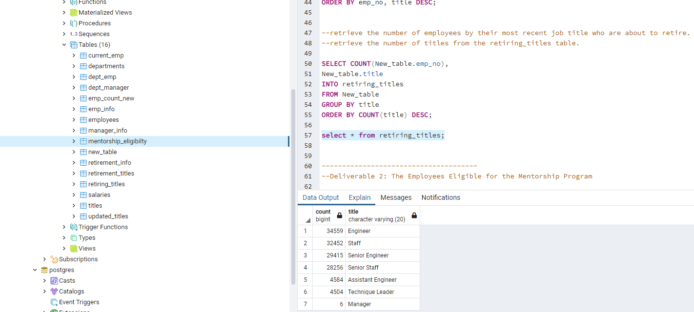
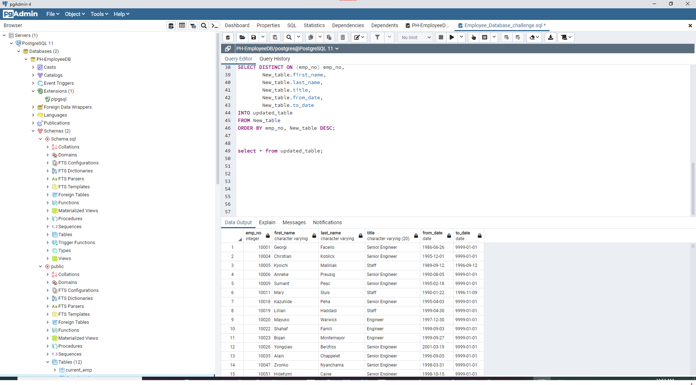
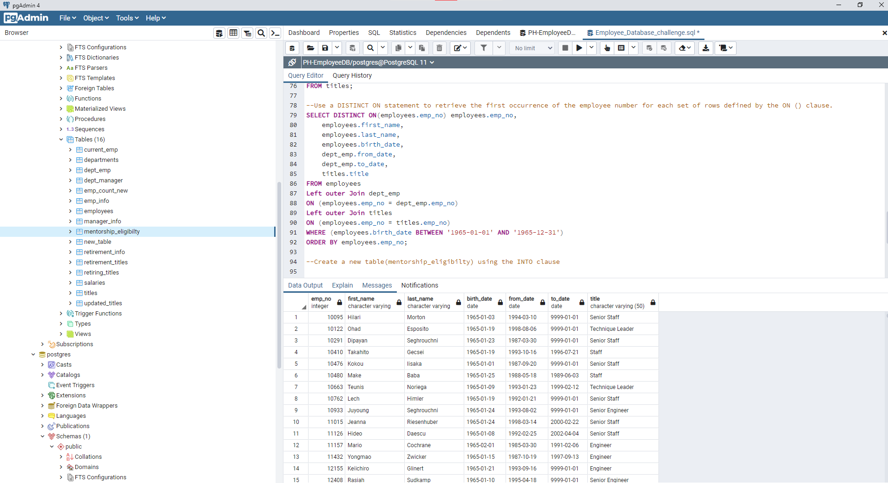

## A written report on the employee database analysis for Pewlett Hackard by Nayan Patel

## Overview of the analysis:

To determine the number of retiring employees per title, and identify employees who are eligible to participate in a mentorship program.

This analysis consists of two technical analysis deliverables and a written report

## Deliverables:

Deliverable 1: The Number of Retiring Employees by Title

Deliverable 2: The Employees Eligible for the Mentorship Program

Deliverable 3: A written report on the employee database analysis
## Resources:

csv files: Employees data including, Departments, Department number, By department employees, Start date, to date, Birth date, Names, titles, salaries

## Tools and techniques used:

PostgreySQL, pgAdmin

## Results: Two major points

1. Retrieve the number of employees by their most recent job title who are about to retire and  the number of titles from the retiring_titles table.

2. Creating a new table mentorship_eligibilty as per requirements
 
## Summary:

1. The job titles of the eligible retirees roles will need to be filled as the "silver tsunami" begins to make an impact is given below.

Engineer: 34559

Staff: 32452

Senior Engineer: 29415

Senior Staff: 28256

Assistant Engineer: 4584

Technique Leader: 4504

Manager: 6

## Deliverable1

## Deliverable2

